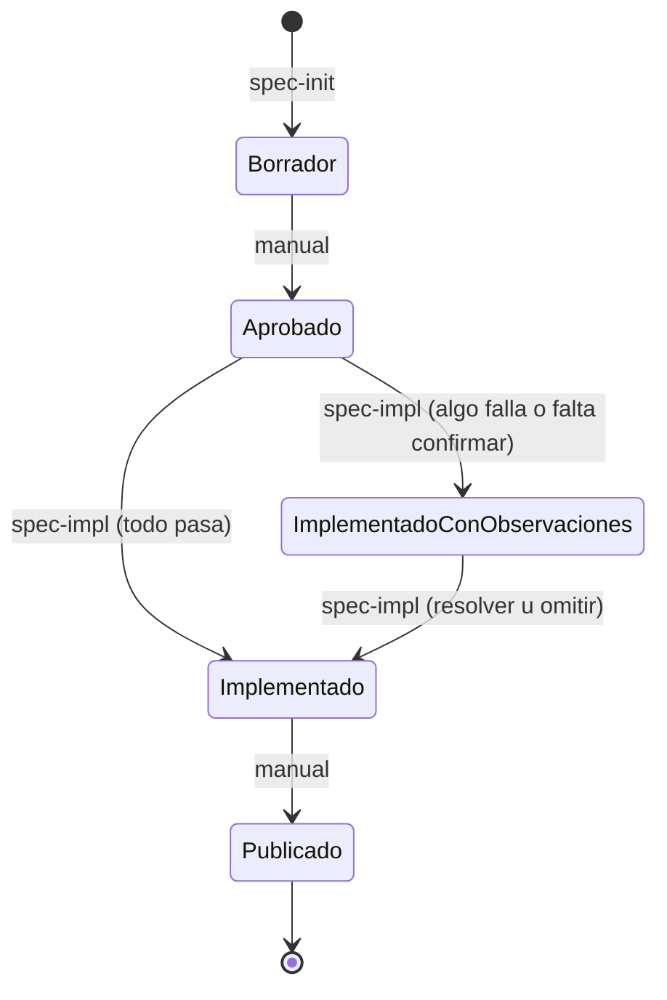

# Grupo `sdd`

Flujo de spec-driven development: planificar (opcional), diseñar una spec, implementarla, auditarla y dejarla lista para commitear. La carpeta `specs/` es la fuente de verdad.

Este README es la referencia única de etapas y estados. Si algo en una skill lo contradice, manda este archivo.

## Etapas

| # | Etapa | Quién | Spec (entrada → salida) | Roadmap |
|---|-------|-------|-------------------------|---------|
| 0 | `/spec-plan <sistema>` (opcional) | Skill | - | crea `specs/00-roadmap.md` en `Planificando` |
| 1 | `/spec-init <feature>` | Skill | - → `Borrador` | ítem `Pendiente → Especificada`; roadmap `Planificando → Activo` |
| 2 | Releer la spec y aprobarla | **Manual** | `Borrador → Aprobado` | - |
| 3 | `/spec-impl NN` | Skill (una confirmación al inicio) | `Aprobado → Implementado` o `Implementado con observaciones` | ítem `→ En progreso`; `→ Hecho` solo si queda `Implementado` |
| 3b | `/spec-impl NN` otra vez | Skill | `Implementado con observaciones → Implementado` (resolver u omitir) | ítem `→ Hecho` |
| 4 | `/spec-finish NN` | Skill | requiere `Implementado`; no cambia el estado | - |
| 5 | `git add` / `git commit` / borrar rama | **Manual** | - | - |
| 6 | Marcar como publicada (ej. tras un deploy) | **Manual** | `Implementado → Publicado` | - |
| - | Descartar | **Manual** | cualquiera → `Obsoleto` | ítem `→ Replantear` (vía `/spec-plan`) |

`/spec-pre-commit` no es una etapa: es la auditoría 4R que `spec-finish` aplica como gate, y también se puede correr sola sobre cualquier commit.

## Qué hacés a mano

- Aprobar la spec: cambiar `**Estado:**` de `Borrador` a `Aprobado`.
- Commitear: ninguna skill ejecuta `git commit` ni `git add` en el camino sin rama.
- Borrar la rama `spec-NN-slug` después del commit (si se usó rama).
- Marcar `Publicado` u `Obsoleto`.
- Editar `specs/.spec-config.yml` si querés rama por spec.

## Estados de la spec



| Estado | Lo escribe | Significa |
|--------|-----------|-----------|
| `Borrador` | spec-init | Spec escrita, pendiente de revisión humana. |
| `Aprobado` | humano | Lista para implementar. Único estado inicial que acepta spec-impl. |
| `Implementado con observaciones` | spec-impl | Hay criterios fallidos o sin confirmar, listados en `## Observaciones`. |
| `Implementado` | spec-impl | Todos los criterios pasaron o se aceptaron explícitamente. Único estado que acepta spec-finish. |
| `Publicado` | humano | En producción. Ninguna skill lo escribe. |
| `Obsoleto` | humano | Ya no aplica. Desde cualquier estado. |

Al leer, las skills aceptan equivalentes en otros idiomas (`Draft`, `Approved`, `Implemented`, `Released`, `Obsolete`, ...). Al escribir, usan el set en español de arriba, salvo que las specs existentes del repo usen otro idioma: en ese caso mantienen el de ellas.

## Estados del roadmap

- **Roadmap:** `Planificando → Activo ⇄ Pausado → Completo`. `Activo` lo pone spec-init al vincular la primera spec; `Completo` lo pone spec-impl cuando todos los ítems quedan `Hecho`; `Pausado` es manual.
- **Ítem:** `Pendiente → Especificada → En progreso → Hecho`, o `Replantear` si su spec quedó `Obsoleto`. `Hecho` = spec vinculada en `Implementado` o `Publicado`.

El roadmap es opcional. Sin roadmap, con uno `Completo` o `Pausado`, o sin vínculo exacto, spec-init y spec-impl funcionan igual y no lo tocan.

## Configuración

`specs/.spec-config.yml` (lo crea spec-init si falta):

| Clave | Default | Efecto |
|-------|---------|--------|
| `AutoCreateBranch` | `false` | `false`: spec-impl trabaja en la rama principal; si estás en otra rama, pregunta. `true`: crea y usa `spec-NN-slug`. |

## Flujo típico

```bash
/spec-init niveles-y-highscores   # queda specs/NN-slug.md en Borrador
#  ... releer y cambiar Estado a Aprobado ...
/spec-impl NN                     # implementa todo y verifica
/spec-finish NN                   # audita y propone el mensaje de commit
#  ... git add / git commit a mano ...
```

Sistema nuevo desde cero: `/spec-plan` primero, y después el loop de arriba por cada ítem del roadmap, en orden.
